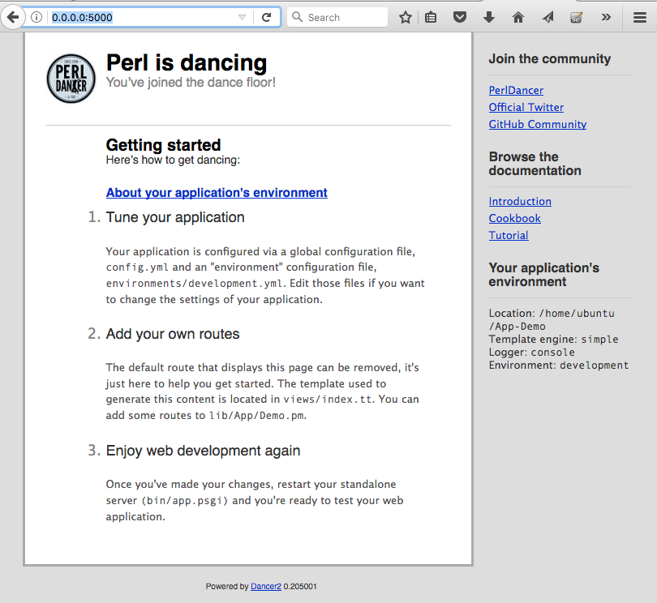

# Create a Dancer Application


```
$ dancer2 gen -a Demo::App
```

This will create a directory called `Demo-App` right where you are, a bunch of subdirectories and files in it.
This is the skeleton of an application. It will print the names of the directories and files as it creates them
and at the end it prints out the instructions to follow:

```
The application is ready to serve; to run it, do:

        cd App-Demo
        plackup bin/app.psgi
```

We follow the first command changing directory into the newly created directory:

```
cd App-Demo
```

but then, before we launch the application, we try to run the tests that come with the application:

```
$ prove -l

t/001_base.t ......... ok
t/002_index_route.t .. 1/2 [Demo::App:72178] core @2017-09-23 22:40:16> looking for get / in .../Dancer2/Core/App.pm l. 36
[Demo::App:72178] core @2017-09-23 22:40:16> Entering hook core.app.before_request in (eval 220) l. 1
[Demo::App:72178] core @2017-09-23 22:40:16> Entering hook core.app.after_request in (eval 220) l. 1
t/002_index_route.t .. ok
All tests successful.
Files=2, Tests=3,  1 wallclock secs ( 0.04 usr  0.01 sys +  1.30 cusr  0.13 csys =  1.48 CPU)
Result: PASS
```

Most of the books and tutorials I've seen run ahead and build an application neglecting the testing. In this book I'd take a different approach.
Even if we don't get to strick Test Driven Development (TDD) we will write automated tests as we experiment with Dancer and as develop the application.
It is both a better practice than writing application without test, but I also have to admit I am addicted to tests.

Every time I need to make changes to an application that does not have tests I feel very unsafe. Will my change break anything? Will we notice the breakage
soon or only after we have deployed the application or only after a customer lost a million dollars?

Anyway, now that we saw that the tests that came with the skeleton work, we should check if the skeleton really works. So type in

```
plackup bin/app.psgi
```

It will print something like this:

```
HTTP::Server::PSGI: Accepting connections at http://0:5000/
```

Then you can use your browser to visit the URL printed on the screen. It will redirect to http://0.0.0.0:5000/
and will show the content of the Dancer default page.




## Troubleshooting

If you get an error like this:

```
Error while loading /home/ubuntu/App-Demo/bin/app.psgi: Can't locate Plack/Middleware/Deflater.pm in @INC (you may need to install the Plack::Middleware::Deflater module) (@INC contains: /home/ubuntu/App-Demo/bin/../lib /home/ubuntu/perl-5261/lib/site_perl/5.26.1/x86_64-linux /home/ubuntu/perl-5261/lib/site_perl/5.26.1 /home/ubuntu/perl-5261/lib/5.26.1/x86_64-linux /home/ubuntu/perl-5261/lib/5.26.1) at /home/ubuntu/perl-5261/lib/site_perl/5.26.1/Plack/Util.pm line 26.
```

that means that you are using a version of Dancer that still has this missing dependency bug and you have not installed the dependency yourself.

Go back to the part where we [installed Dancer](#install-dancer) and follow the instructions at the end of the chapter where we installed the extra modules.

## Skeleton

So what did this skeleton create?

If you switch back to the terminal window and press Ctrl-C it will stop the server and you can look around the directory created by the `dancer2` command.


```
$ tree
```

A> By default the `tree` command is not installed. If you'd like to run it first you need to install it using `sudo apt-get install -y tree`

This is what we got:

```
.
├── bin
│   └── app.psgi
├── config.yml
├── cpanfile
├── environments
│   ├── development.yml
│   └── production.yml
├── lib
│   └── App
│       └── Demo.pm
├── Makefile.PL
├── MANIFEST
├── MANIFEST.SKIP
├── public
│   ├── 404.html
│   ├── 500.html
│   ├── css
│   │   ├── error.css
│   │   └── style.css
│   ├── dispatch.cgi
│   ├── dispatch.fcgi
│   ├── favicon.ico
│   ├── images
│   │   ├── perldancer-bg.jpg
│   │   └── perldancer.jpg
│   └── javascripts
│       └── jquery.js
├── t
│   ├── 001_base.t
│   └── 002_index_route.t
└── views
    ├── index.tt
    └── layouts
        └── main.tt

11 directories, 23 files
```

The `bin/app.psgi` is a PSGI file that stands for Perl Web Server Gateway Interface. It is a standard between Perl scripts and application servers written in Perl.
`plackup`, the command we used to launched the server is a small PSGI-based web application server good for development purposes.
You can read more about [Plack and PSGI](http://plackperl.org/). For our purposes it is enough to know that Dancer adhers to the PSGI specification and thus we can use
and PSGI based web application server to run it. During development we are going to use `plackup`. When we get to [deployment](#deployment) we will discuss out options
that match the demand of a web application hit by thousands or millions of requests.

The content of the `bin/app.psgi` file is not very interesting for us now.

The lib/App/Demo.pm file is the Perl module that implements the routes.

The one we have looks like this:

<<[code/1/lib/App/Demo.pm](code/1/lib/App/Demo.pm)


