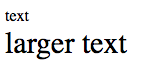

# CSS {#css}

HTML used to defined the structure of the page. 
CSS - Cascading Style Sheets - is used to make it look good. CSS is used to set sizes, colors, relative location of some items on an HTML page.

In CSS we can create rules that will impact specific elements on the page. In order to address the elements CSS provides a way to address them.
It is usually called "CSS Selectors". The same method can be used in other technologis as well. For example most of the JavaScript libraries
such as jQuery, will use the same technique to address elements on a page.

## How to use CSS?

### CSS per element

We attach CSS rules to the specific elements in an HTML document using the `style` attribute.

<<[code/css/a.html](code/css/a.html)

Here we set the style of a specific HTML element. `font-size` is one of the many CSS attributes. We set it to be 30px (30 pixel).

Loading that page will look like this:



However this is not very scalable. You'd have to add style to every element.

### CSS Embedded in HTML

We can use the `style` HTML tag to embed a whole section of CSS instructions in the HTML document.
This is much better as now we can have all the CSS rules in one place, but then we need a way to tell the browser which rule applies to which HTML element.
We'll look at these CSS selectors in a second. For now just observe that we achieved the same result as earlier with an embedded style-sheet.

This is more generice than the previous option, but if we have multiple pages we'll have to embed the style-sheet in every page.

<<[code/css/b.html](code/css/b.html)

In this code `#x` is a selector that will select the element with ID `x`. The selector is followed by curly braces
that contain the CSS attributes.


### Reference external CSS file

Last, and the most generic way is to put the CSS rules in a separate file:

<<[code/css/c.css](code/css/c.css)


and then use the `link` element to reference that file in our HTML documents:

<<[code/css/c.html](code/css/c.html)

When the browser loads the HTML page, it parses the content. When it notices the `link`, the browser will fetch the CSS file
in a separate request, load it into memory and apply to the page.

This means we only need to repeate the `link` element. It also means that the browser can cache the CSS file and if a user
visits several pages on your site or if she visits your site more than once then the CSS file is already available and the
user will see the result faster.

In Single Page Applications this gain is less important as your application has only a single HTML file and thus the CSS
needs to be loaded only once anyway.

There is also a drawback in having a separate CSS file and allowing the browser to cache it. If you update the CSS file you'll
need to find a way to force all the vistors to load the new version of the CSS file or they will keep seeing the outdated style.

This is also a problem during development when you keep changing the CSS file and you'd like to see the results immediately.

#### Forcing CSS file reload

There are several techniques to force the reloading of the CSS content. One is to change the name of the CSS file every time
we create a new version and then to update all the HTML pages to refer to the new file. This is much easier than it sounds
as most of the HTML pages are generated from a common template anyway.

Another technique is to add a parameter to the end of the filename in the `link` tag:

```
<link href="c.css?version=N" rel="stylesheet">
```

where N is the version number of the current edition of the CSS file.

Instead of version number we could also attach the timestamp of the file.

## CSS Selectors

The CSS Selectors are used to address specific elements on the page.

### Select by tag

We can use the name of the HTML tag to select all the elements with that tag. In this example 

<<[code/css/s1.html](code/css/s1.html)


### Select by id

We have already seen this. We need to add an `id` to the HTML elements and then we can address them specifically
by a CSS selector that starts with a `#`.

<<[code/css/b.html](code/css/b.html)

The IDs need to be unique on a single HTML page or the CSS selector will get confused.
The IDs should also be a lot more meaningful than what we have in this example.

### Select by class

<<[code/css/s3.html](code/css/s3.html)


