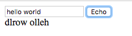

# Echo - SPA

We already know how to send a GET request to the web server to retrieve a fixed thing, but we don't know how to send some data to the server. A very simple application I like to write to see how this works is called echo. It shows a text box and a button. When we press the button it sends the text we typed in to the server which promptly returns it.

## Echo the code

To make it a bit more fun, instead of sending back the string as we received we are going to return it backwards.


Just as in the previous examples, here too we have two routes. One serving the root URL at `/` and one serving the API call at `/api/echo` but this time the API route is declared with the `post` keyword. We'll get there in a minute. First let's take a look at the application.

We can launch the development server using `plackup`:

```
plackup code/echo.psgi
```

Then we can visit the web page with our browsers. The first page we see looks like this:


We can type in some text and click on the `Echo` button to get this without reloading the page:



In the HTML part we have now 3 HTML elements. An `input` element that has an `id` called `txt`. That's where the use can type in text.

We have a `button` element that also has an id and some text between the opening and closing part. This is the text that will appear on the button.

Finally we have an empty `div` element that too has an id.

As you might notice when we build Single Page Applications we tend to assign IDs to many HTML elements and we don't assign name attributes.  The IDs make it easy to address these elements and the name attributes are fairly useless.

The first `script` tag is the same as we had earlier. It only loads jQuery. The second `script` tag contains the specific jQuery code. Everything is wrapped in the following code as all this code should only run after the page was rendered.

```
$().ready(function () {

});
```

The next line locates the element that has the ID `echo` which is our only button, and to the `click` event of that button attaches an anonymous callback function. As I've explained earlier most or all of the HTML elements have associated events that are generated by some external action. For example by the user doing something (e.g. hovering over an element or, in this case, clicking on a button). We can map each event to a function and when the event happens our browser will execute that function.

In this case we attached a function to click event of the button.

```
$('#echo').click(function () {
```

What happens when the user clicks the button?

We access the element that has the ID `txt` and we fetch the value from that element.

```
$('#txt').val()
```

In the first line in the function we print this value to the console of the browser.

Then we use the `$.post()` function of jQuery to send a POST-request to the server. The first parameter of this function is the URL where we send the request. In our case it is `/api/echo`.

The second parameter is a JavaScript object. Something that looks very similar to a Perl HASH. (except that instead of fat arrow `=>` we use the colon `:` to separate key and value. The key is `txt`, the value is what was typed in the input element.

```
{
    txt: $('#txt').val(),
},
```

The third parameter of the `post` request is another anonymous function. This function will be executed when the response from the server arrives. The content of the response will be passed as parameter to this function. If the server provides a well known Content-Type then the content will be first processed accordingly and the result of this processing will be passed to the function.

In our case, if you look at the second route in the Perl code, you will see that it sets the content type to `application/json`. This means jQuery will take the content received from the server. It will assume we received a JSON string and will convert it to a JavaScript object.

Hence in the function we can already use the `data` variable as a JavaScript object and access the "result" field.

In the last line in the JavaScript code, in

```
$( "#result" ).html( data["result"] );
```

we locate the empty `div` using the `$( "#result" )` CSS selector and then we set the content of the tag to be the result we received from the server.

If you look closer at the second route, you can see that it is declared using the `post` keyword supplied by Dancer. Just as earlier we use the `header` keyword of Dancer to set the header returned to the client. This will take effect in the specific route where it is executed.

Then comes the new code. The `body_parameters` keyword provided by Dancer returns a hash containing all the key-value pairs that were sent in a POST request. We expect the client to send in a key-value pair where `txt` is the key. Here we extract the value sent by the client. This is the text the user typed in the input-box.

```
post '/api/echo' => sub {
    header( 'Content-Type'  => 'application/json' );
    my $txt = body_parameters->{'txt'};
    return encode_json { result => scalar reverse $txt };
};
```

Finally we call the `reverse` function of Perl to reverse the order of characters in the string. `reverse` is a funny function. It behaves differently in LIST and SCALAR context. Because the fat arrow `=>` in the last line creates a LIST context and we need the function to be in SCALAR context we need to call the `scalar` function that will force `reverse` into SCALAR context.

An alternative to the `scalar` function and to the above explanation, would be to use a temporary scalar variable:

```
    my $txt = body_parameters->{'txt'};
    my $response = reverse $txt;
    return encode_json { result => $response };
```


## Testing Echo

The code testing the echo application is not that different from the previous tests, but we do have a section where we send a `POST` request and supply some data.

For this we had to import the `POST` keyword from HTTP::Request::Common. The request itself has the data in a hash just after the URL where the request will be sent.

```
my $echo  = $test->request( POST '/api/echo' , { txt => 'abc' });
```

We first checked if the response was successful, if it returned `200 OK`, and then we compare the response to a fixed string that is the JSON representation of our hash:

```
is $echo->content, '{"result":"cba"}', 'echo abc=cba';
```

We can do that because we only have a single key-value pair. If we had more keys we would not be able to anticipate the order they were converted to JSON so we would take the JSON we received. We would convert it back to a Perl hash, and then we would use the `is_deeply` function from Test::More;


The full test code can be seen here:


